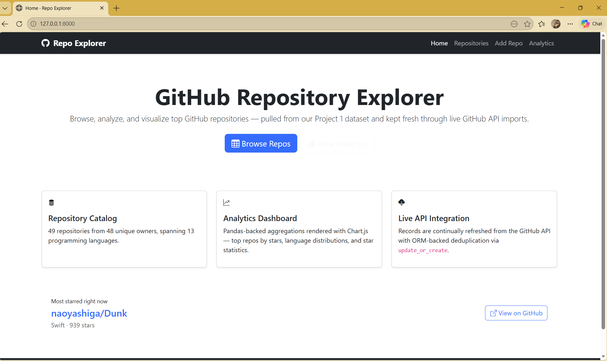
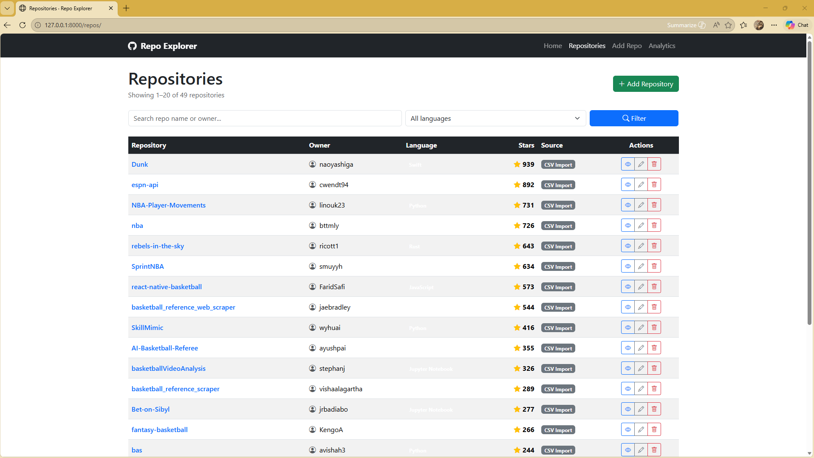
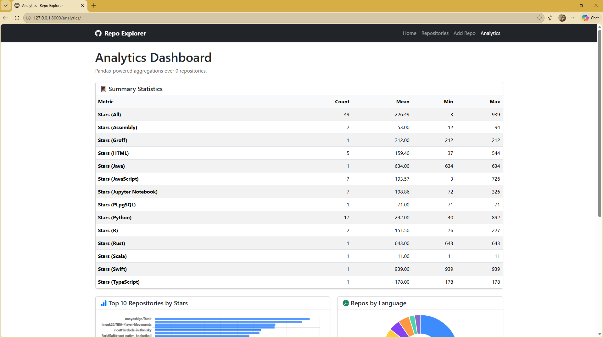
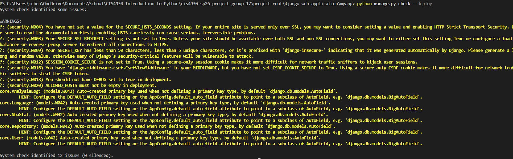

# CIS4930 (Introduction to Python) Group 17 Django Web Application Project

## Group Members
Matthew Chen - mchenrep  
Luke Salem - lukehsalem  
Eric Pengili - sicc-ranchezz  
Tony Guillen - tonyguil1  

## Basketball Data Web Application
This repository details basketball related Github repositories (from Project 2) and an example of how you can use basketball
data in a meaningful way (from Project 1) in a web application based on the Django framework for Python. Users will be able to see basketball data transformed into real world inferences and visualizations and then have the ability to find other basketball related repositories that they might be interested in.

## Original Dataset and API documentation
[Original Dataset from Kaggle](https://www.kaggle.com/datasets/bilgehanyaylali/nba-advanced-stats-2000-2009/data)  
[Github API Documentation](https://docs.github.com/en/rest)

## Application Features
- Homepage
    - Brief description of the dataset and navigation bar
- List View of Basketball Repositories
    - Shows a list of Basketball related Github repositories with pagination
    - Option to create/update/delete records of basketball related Github repositories
- Detailed View of Basketball Repositories
    - Shows a detailed description of the basketball related Github repository of interest
- Analytics Page
    - Utilizes pandas module to create meaningful aggregations of basketball related repositories
    - Charts to visualize data from basketball related repositories (stars, language, etc.)
    - Summary statistics table of basketball related repositories (which includes count, mean, min, max)
- UI
    - Implements Bootstrap 5 UI features and CSS to style pages

## Setup Instructions
1. First clone the repository with `git clone repositoryURL`  
2. Install the requirements/dependencies with `pip install -r requirements.txt`  
3. Migrate all models with `python manage.py migrate` 
4. Get API data with `python manage.py fetch_data` 
5. Load models with `python manage.py seed_data`
6. Finally, run the server locally with `python manage.py runserver`

## Screenshots
Homepage  
  
List View  
  
Analytics Dashboard  
  
Security (manage.py check --deploy)
  

## Project Demonstration
Matthew Chen - [Youtube Link](https://youtu.be/C22R1EuAXkA)

Luke Salem - [Youtube Link](https://youtu.be/khD4dP34KjE)

## Contributions
Matthew Chen - Framework Setup/Repository Structure, README, Basic URL Routing, Models ORM, fetch_data.py, seed_data.py 
Tony Guillen - Templates HTML Implementation, Bootstrap 5 UI, CSS, Charts  
Eric Pengili - Security, Settings, Deployment Readiness, Alternative MyApp application  
Luke Salem - Analytics Dashboard, Models ORM, Charts  
